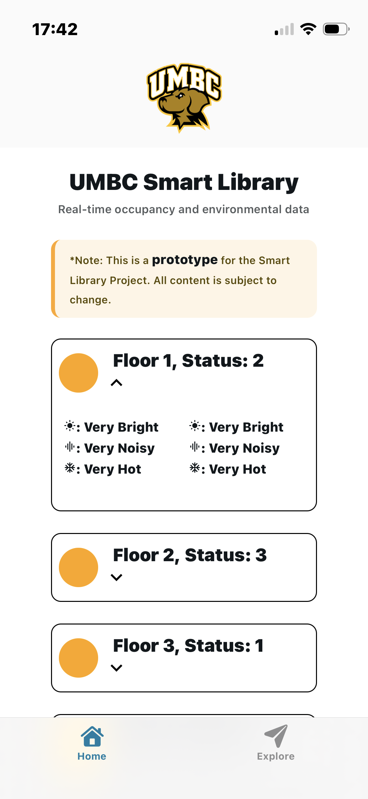
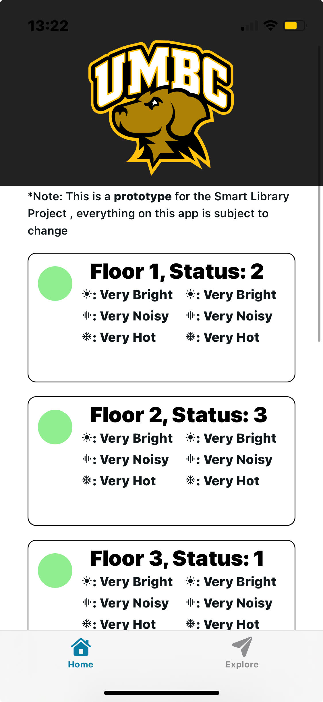
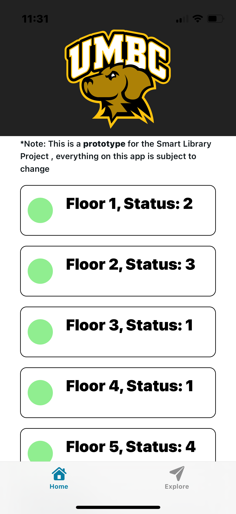
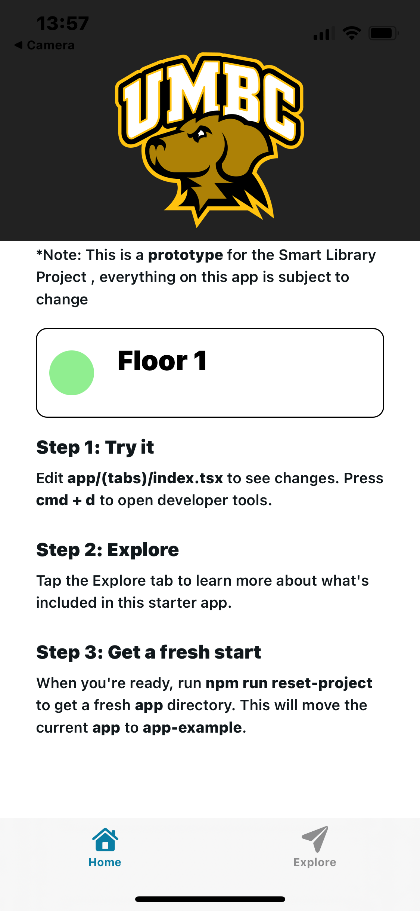
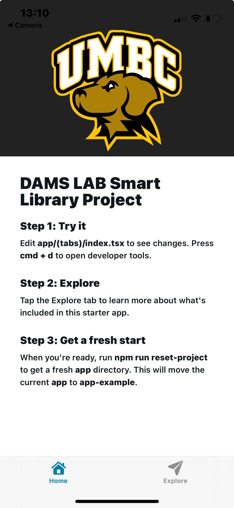

# DAMSlabUMBC-SmartLibrary
Hello! Welcome Smart Library app for the DAMS Lab at UMBC. This repo will be for creating a frontend React Native application that will pipe in synthetic data to display to the user. This is meant as a prototype as of Sep 1, 2025.

## Tech Stack
- React Native
- Expo Go

## Getting Started
1. **Clone The Repository**
    - HTTPS: `git clone https://github.com/pearcepackman/DAMSlabUMBC-SmartLibrary`
    - SSH: `git clone git@github.com:pearcepackman/DAMSlabUMBC-SmartLibrary.git`
2. **Navigate To App Directory**
    - Note that the app directory is in /SmartLibrary, **not** the home dir of this Repo!
    - `cd SmartLibrary`
2. **Install Dependencies**
    - `npm install`
3. **Run The Development Server**
    - `npx expo start`
4. **Download Expo Go App and Scan QR Code**
    - This will bring up the development app on your phone :)

## Update History
- 9/10/2025 - Added some FloorTab text, messing around with emojis instead of just text, testing branches
- 9/5/2025 - Added FloorTab component, takes in floor number and status, will be adding more functionality to this soon!
- 9/4/2025 - Fixed README.md to display pictures correctly :)
- 9/3/2025 - Updated styling, added prototype note at top, began floor layout, added progress screenshot
- 9/1/2025 - Created repo, initialized Expo Go app, wrote startup instructions, changed boilerplate slightly with UMBC logo, added `media` directory, added screenshot to README.md

## Screenshots and Media

  <table>
    <tr>
    <td align="center">
         
        <em>Home Page as of Sep 10, 2025</em>
      </td>
    <td align="center">
         
        <em>Home Page as of Sep 10, 2025</em>
      </td>
      <td align="center">
         
        <em>Home Page as of Sep 5, 2025</em>
      </td>
      </tr>
      <tr>
      <td align="center">
         
        <em>Home Page as of Sep 3, 2025</em>
      </td>
    <td align="center">
         
        <em>Home Page as of Sep 1, 2025</em>
      </td>
    </tr>
  </table>

